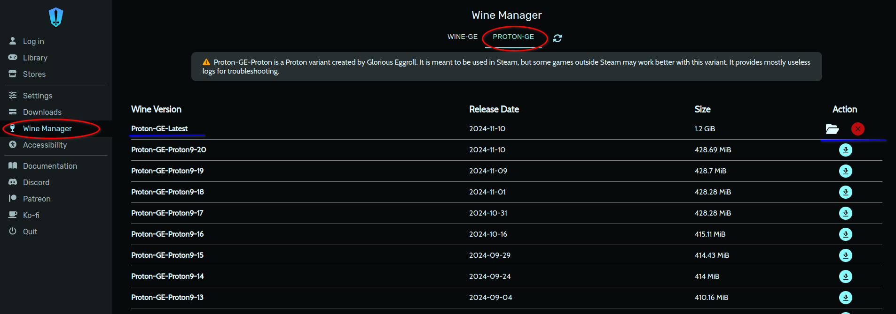
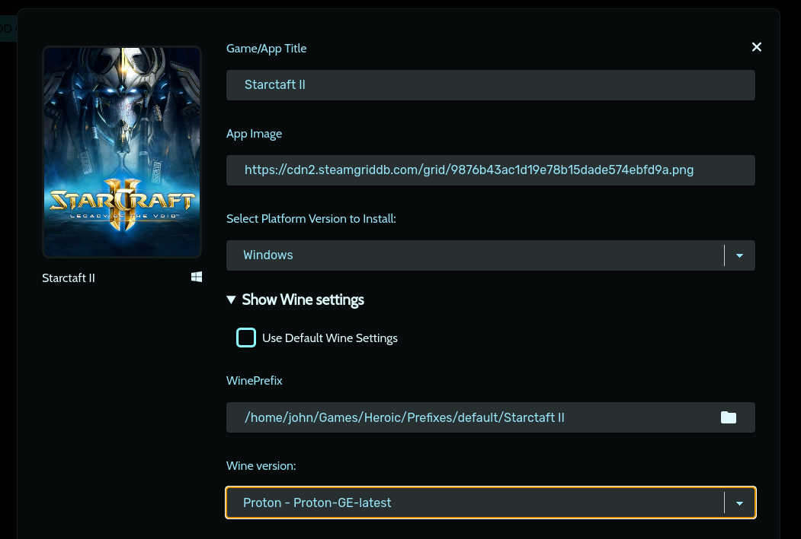
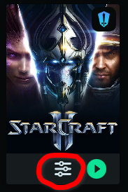
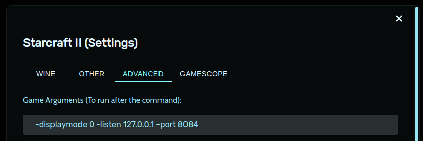

# Development Environment Setup on Linux Host

## StarCraft II game installation

1. **Download Heroic Launcher**
2. **Create a Blizzard Account**
    - If you don’t have one, create a Blizzard account, or use an existing account.
3. **Download StarCraft II for Windows**
    - Download the [StarCraft II Windows executable](https://download.battle.net/en-us?product=sc2&blzcmp=sc2_gamesite).
4. **Get the Latest Proton-GE Version**
    - Open Heroic Launcher, select **Wine Manager** from the left menu.
    - In the upper tab, go to **Proton-GE** and download the latest Proton-GE version.
      
5. **Add StarCraft II to Heroic Library**
    - In Heroic Launcher, click the **Add Game** button and set up the following details:
        - **App Title**: StarCraft II
        - **App Image**: This should autofill.
        - **Platform**: Ensure **Windows** is selected.
    - Click **Show Wine Settings** and under **Wine Version**, select **Proton-GE Latest**.
      
    - Enable **Run Installer First**. When prompted, locate and select the downloaded StarCraft II executable, then
      follow the installation instructions.
    - After successful installation, set the **Executable** to **SC2Switcher_x64.exe**, typically located at:
      ```
      ~/Games/Heroic/Prefixes/default/Starcraft II/drive_c/Program Files (x86)/StarCraft II/Support64/SC2Switcher_x64.exe
      ```
      and click to **FINISH**
      ![[executable-path.png]]

## Setting game startup options

Trough Heroic Launcher, you can specify startup options for the StarCraft II game. To do this, click the **Settings**
button on the StarCraft II game tile:



and in the **Advanced** tab, add the following options:



What these options do:

- **API listen enable**: Set the StarCraft II client API listen port using `-listen 127.0.0.1 -port 8084`. This will
  enable local communication between your bot and the game.
- **Window game mode set**: To optimize your development experience, you can also configure the following startup
  options: `-displaymode 0`

## Adding some maps

To be able to play games, you need to have some maps. You can get an example map (same map which is used across all
tutorials) from
the [following link](https://github.com/dubblen/sc2ai/raw/refs/heads/master/bootstrap/maps/BerlingradAIE.SC2Map). Place
the map in the following
directory `~/Games/Heroic/Prefixes/default/Starcraft II/drive_c/Program Files (x86)/StarCraft II/maps` (in the case you
have installed StarCraft II in the default location).

## Troubleshooting

### Heroic Launcher Battle.net Installer Shows Blank (Black) Windows

- This may be a window manager issue. Try switching to a standard window manager, like GNOME or KDE Plasma, which are
  known to work well with Heroic Launcher.
